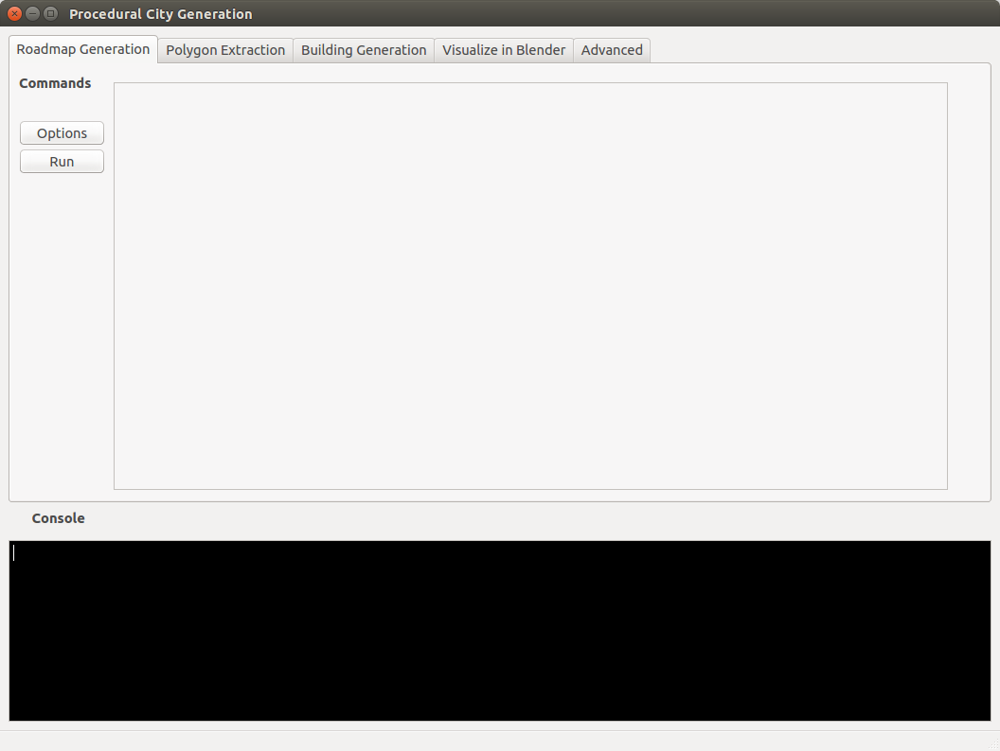
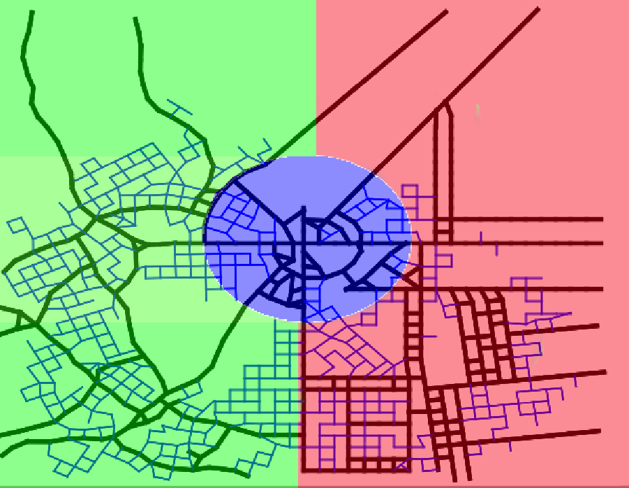
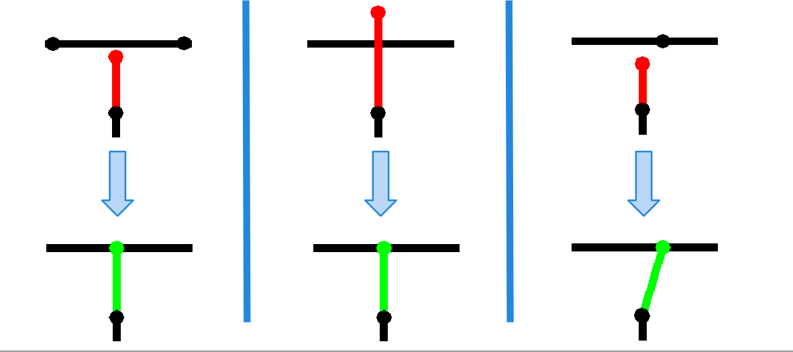

.. procedural_city_generation documentation master file, created by
   sphinx-quickstart on Fri Aug 21 11:27:23 2015.
   You can adapt this file completely to your liking, but it should at least
   contain the root `toctree` directive.

**Procedural City Generation in Python - Documentation**
========================================================

.. image:: images/currentstate.png
   :align:   center
   :target: `Procedural City Generation in Python - Documentation`_
   :height: 600px
   :width: 1062 px

Welcome to procedural_city_generation's documentation! In this page we will give an overview of all the things you need to know to get started  with this project.

Index
++++++++

* `Getting it to work`_
* `Roadmap Creation`_
* `Polygon Extraction and Subdivision`_
* `Creation of 3D Data`_
* `Visualization in Blender`_
* :ref:`modindex`
* :ref:`search`
* :ref:`genindex`

**Getting it to work**
--------------------

You can get the source code at our `Github Page <https://github.com/josauder/procedural_city_generation>`_

If you have git installed, you can clone the repository instead of downloading it as a .zip archive
with::
    git clone https://github.com/josauder/procedural_city_generation.git

**Dependencies:**

* python 2.7+
* numpy (1.8.2+)
* scipy (0.14.1+)
* matplotlib (1.4.2+)
* PyQt4 (4.8.6+)
* Blender 2.6x+

All dependencies except Blender should be included in any scientific python distribution (e.g. Python(x, y) and Anaconda).
To start the program with the GUI (assuming all dependencies are installed)::

    cd procedural_city_generation
    python GUI.py

If everything worked so far, the GUI should open up and look like this:

If not, then there is probably a missing dependency. As of now, this project runs on both Python 2 and 3.
The last step ("Visualize in Blender") will not work on windows machines because you can not run blender by simply typing::

   blender --python "procedural_city_generation/visualization/blenderize.py"

from the command line. On windows you will have to run this script manually by opening blender, and replacing the path with the path to procedural_city_generation/procedural_city_generation directory.

**About this Project**
------------------------

This project started as a university project at the Technische Universität Berlin.
After the semester was over, we continued working on the project though, with the goal in mind to make it usable for as many people as possible.
 

**Roadmap Creation**
--------------------

Credits and Acknowledgements
++++++++++++++++++++++++++++++
A lot of our code regarding roadmap generation shows great similarity and in part based on the following papers:

* Martin Petrasch (TU Dresden). "Prozedurale Städtegenerierung mit Hilfe von L-Systemen". 2008, Dresden. https://www.inf.tu-dresden.de/content/institutes/smt/cg/results/minorthesis/mpetrasch/files/Beleg_MPetrasch.pdf

* Yoav I. H. Parish (ETH Zürich), Pascal Müller (Centrap Pictures, Switzerland). "Procedural modeling of cities". *Siggraph '01* 301-308 (2001). New York, NY, USA. https://dl.acm.org/citation.cfm?id=383292

Introduction
++++++++++++++++

We refer to "road segments" as edges and the two ends of an edge as a vertex.
We create roadmaps by starting with an axiom (a list of Vertices) and defining a set of rules by which new Vertices are added and connected to existing one to form Edges. 
Many of the terms used here become obvious when you see them in action. Let's start by showing the most important inputs:

The Growth-Rule Image
++++++++++++++++++++++
.. image:: images/growthrule.png
   :align: center
   :target: `The Growth-Rule Image`_
   :height: 400px
   :width: 400 px

This image describes which growth rule will be used in which area. Blue means that the radial rule will be used, Red means that the grid rule will be used, and Green means that the organic rule will be used. We will discuss the rules in detail later.

The Population-Density Image
+++++++++++++++++++++++++++++

.. image:: images/populationdensity.png
   :align:   center
   :target: `The Population-Density Image`_ 
   :height: 400px
   :width: 400 px
   
This image describes the probabilities that vertices will be connected at all.
The lighter, the more probable it is, that an edge will be built.

The Output
++++++++++++++++++++++

.. image:: images/roadmap.png
   :align:   center
   :target: `The Output`_ 
   :height: 400px
   :width: 400 px
   
This is what the finished roadmap for a relatively small city looks like. 
As you see there are main roads and minor roads. 
The correlation between the input and the output is also very clear in this example.

Correlation between Input and Output
++++++++++++++++++++++++++++++++++++++

.. image:: images/result.png
   :align:   center
   :target: `Correlation between Input and Output`_ 
   :height: 400px
   :width: 400 px

   
It should now have become clearer as to what the growth rules and the population density actually describe. 

How Vertices are managed
+++++++++++++++++++++++++

As mentioned, we start with an axiom. In the beginning, every vertex of the axiom is in the "front", the list of vertices from which new vertices well be suggested.
For every vertex, a (possibly) empty list of new suggested vertices is then created. The position of these suggested vertices depends on the growth rule. For example,
if we use the grid rule, the suggested vertex for the direction "forward" is simply adding the previous edge to the vertex we are making suggestions from, and "turning" means adding this vertex rotated by either 90 or 270 degrees.
All suggested vertices are then "checked" - this means we handle the following cases:

1. When a new vertex is placed too close to an existing vertex, we focus on the edge to that existing vertex instead.
2. When a new vertex is placed, so that the edge to that vertex stops shortly before an existing edge, we lengthen that edge to the intersection of the two edges.
3. When new vertex is placed, so that the edge to that vertex intersects an existing edge, we shorten the edge to the intersection of the two edges. This also has to be checked after case 1 has been handled.

An illustation of these cases:

If none of these cases apply, the new vertex is placed and is added to the front. If there is no vertex suggested that followed the "turn" part of the growth rule, the vertex will also be added to the vertex_queue. After a vertex has spent a certain amount of iterations in the vertex_queue, it is readded to the front, under the growth rule "seed". This growth rule starts producing vertices with the "minor_road" rule.

The Growth Rules
+++++++++++++++++++

Below is a table describing how we suggest new vertices from a vertex by following a rule. We always need to have the previous_vector to that vertex saved.

+------------+-----------------------------------------------------------------------------------------------------------------------+-------------------------------------------------------------------------------------------------------------------------------+------------+-------+
| **Rule**   | Forward                                                                                                               | Turn                                                                                                                          | pForward   | pTurn |
+============+=======================================================================================================================+===============================================================================================================================+============+=======+
| grid       | vertex+previous_vector                                                                                                | vertex+rotate(previous_vector, 90)                                                                                             | 1          |  0.09 |
+------------+-----------------------------------------------------------------------------------------------------------------------+-------------------------------------------------------------------------------------------------------------------------------+------------+-------+
| organic    | vertex+rotate(previous_vector, random(-30, 30))                                                                         | vertex+rotate(previous_vector, random(60, 120))                                                                                 | 1          |   0.8 |
+------------+-----------------------------------------------------------------------------------------------------------------------+-------------------------------------------------------------------------------------------------------------------------------+------------+-------+
| radial     | We check if the previous_vector is closer to radial or tangential, and adjust it to that. Then vertex+adjusted_vector | We check if the previous_vector is closer to radial or tangential, and adjust it to the opposite. Then vertex+adjusted_vector | 1          |  0.07 |
+------------+-----------------------------------------------------------------------------------------------------------------------+-------------------------------------------------------------------------------------------------------------------------------+------------+-------+
| seed       |                                                                                                                       | vertex+rotate(previous_vector, 90)                                                                                             |            |   0.4 |
+------------+-----------------------------------------------------------------------------------------------------------------------+-------------------------------------------------------------------------------------------------------------------------------+------------+-------+
| minor_road | vertex+previous_vector                                                                                                | vertex+rotate(previous_vector, 90)                                                                                             | 0.05       |  0.85 |
+------------+-----------------------------------------------------------------------------------------------------------------------+-------------------------------------------------------------------------------------------------------------------------------+------------+-------+

Here you can see a demonstration of what the three main growth rules look like: 

.. image:: images/rules.png
   :align:   center
   :target: `The Growth Rules`_
   :height: 400px
   :width: 1000 px

**Polygon Extraction and Subdivision**
-------------------------------------

We split up each of the 'blocks' additionally into 'lots'. On every lot, one building can be placed. Lots that are too large will be omitted from building.

.. image:: images/splitup.png
   :align:   center 
   :target: `Polygon Extraction and Subdivision`_
   :height: 400px
   :width: 400 px

**Creation of 3D Data**
------------------------

We create buildings by choosing various parameters according to the population density, such as the building height and Textures.

We then start by scaling and or transforming the lot down, and possibly applying a series of operations on each of the walls.

.. image:: images/buildinggeneration.png
   :align:   center 
   :target: `Creation of 3D Data`_
   :height: 350px
   :width: 750 px

**Visualization in Blender**
---------------------------

.. image:: images/visualized.png
   :align:   center 
   :target: `Visualization in Blender`_
   :height: 370px
   :width: 410 px

.. toctree::
   :maxdepth: 2

.. procedural_city_generation

